---
output:
  pdf_document: default
  html_document: default
---

# Conduct Cohort Data Analyses {#cohort}
This chapter describes the step-by-step process of conducting cohort analyses for correlation analyses. You will need to have an account set-up (see [Registration]) and have the sample input file (see [Sample Input File]).

## Step 1 Data Preparation {#input}
Each cohort is required to assemble their data into the standard Excel format from  a variety of sources (xls, stata, sas, or r). The file is used for harmonization and analyses. There are five sheets that are required: three of your own data following best practices and two for the project at hand which will be sent by the PI. The detailed requirements are outlined below. A tool is available on COMETS Analytics to help create this file called create input (see [Create Input]).

### Metabolites
The __*Metabolites*__ sheet contains the meta-data related to the metabolite annotations, where the metabolites are the rows. This sheet requires two input columns: __metabid__ and __metabolite_name__. Additional columns are helpful in the harmonization of metabolites. There are no restrictions on the names of the helpful columns, except HMDB ID and COMP ID should be named __HMDB_ID__ and __COMP_ID__. Additional meta-data include chemical pathways, alternate names, database IDs (HMDB, PubChem, etc.), mass/charge, retention times, etc. This meta-information is important as we are continuously updating the harmonization of metabolite names across studies and platforms. Importantly, the metabolite IDs in the __metabid__ column are required to match the metabolite IDs used in the metabolite abundance matrix (sheet __*SubjectMetabolites*__).

The __*Metabolites*__ sheet contains the meta-data for metabolites used for harmonization.

**a. metabid** is the name of the metabolites which may be different than the chemical ID with the non-standard characters. This is a required field to denote the metabolite columns in __*SubjectMetabolites*__ sheet.
 
**b. metabolite_name**  is a required field to denote the biochemical name of the metabolite, with all the non-standard characters.
 
**c. Helpful columns** columns C-H are an example of additional metabolite information. If possible, cohorts should include as much metabolite information as possible to help in harmonization, especially mass charge, retention time, and HMDB ID.
 

<a href="static/input_metabolites.PNG" target="_blank">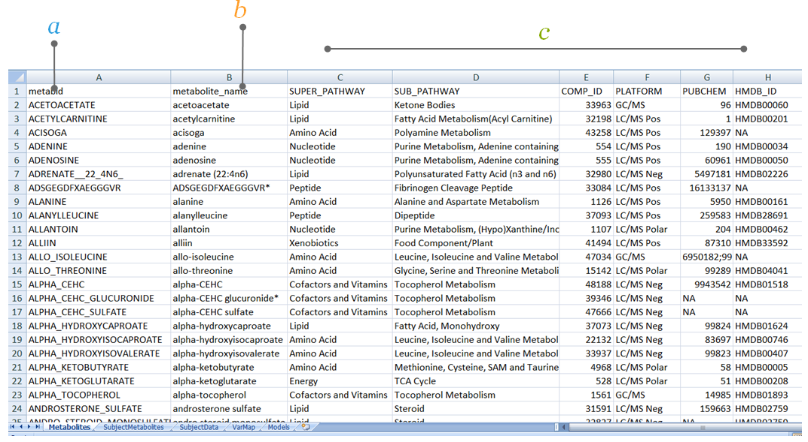</a>

### Subject Metabolites
The __*SubjectMetabolites*__ sheet contains the measured metabolite values for the cohort samples. This sheet would typically be your data analysis file, where the metabolites are the columns and the subjects are the rows. The first column in this sheet represents the sample ID. Each subsequent column represents the measured values of one metabolite. The column names in this sheet (except the column named __SAMPLE_ID__) must match the row names under the column __metabid__ in sheet __*Metabolites*__. Further, the row names in this sheet are required to match the row names in the sheet __*SubjectData*__. Metabolite values should be analyses-ready.

The __*SubjectMetabolites*__ sheet contains the measured metabolite values for the cohort samples.

**a. SubjectMetabolites** this sheet in the input file contains the measured metabolite values for each sample.
 
**b. SAMPLE_ID**  contains the study sample IDs, the subject identifier.
 
**c. Metabolite ID** is indicated in the first row of the sheet to represent all metabolites listed in the __*Metabolites*__ sheet.
 
**d. Each row**  represents data for each subject in the cohort.
 
**e. Value**  reflects the analyses-ready metabolite abundances.

<a href="static/input_subjectmetabolites.png" target="_blank">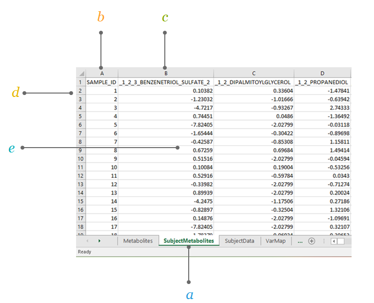</a>

### Subject Data
The __*SubjectData*__ sheet contains the subject-level data where columns are data and each row represents a unique subject. Importantly, these column names do not need to be harmonized according to the final meta-analysis names; this function is handled separately within the __*VarMap*__ sheet. Equally important, the row names in this __*SubjectData*__ sheet must match the row names of the __*SubjectMetabolites*__ sheet.

The __*SubjectData*__ sheet contains the subject-level covariate data (all other information besides metabolites; the coding is laid out in the __*VarMap*__ sheet) for each sample. 

**a. SubjectData** sheet contains the subject-level covariate data for each sample. Examples include factors such as age, gender, smoking, body mass index, race, and education.
 
**b. SAMPLE_ID**  contains the sample identifiers.

**c. Columns** correspond to subject level covariates, as used in the cohort. Column names are in row 1 and (except the column named __SAMPLE_ID__) must match the entries in the column __COHORTVARIABLE__ from the sheet __*VarMap*__.

**d. Rows** correspond to observations, with each row containing all of the subject-level covariate values for a given sample. Row names (e.g., __SAMPLE_ID__) are required to match the row names in the sheet __*SubjectMetabolites*__.
 
**e. Cells** contain subject-level covariate values.

<a href="static/input_3subjectdata.png" target="_blank">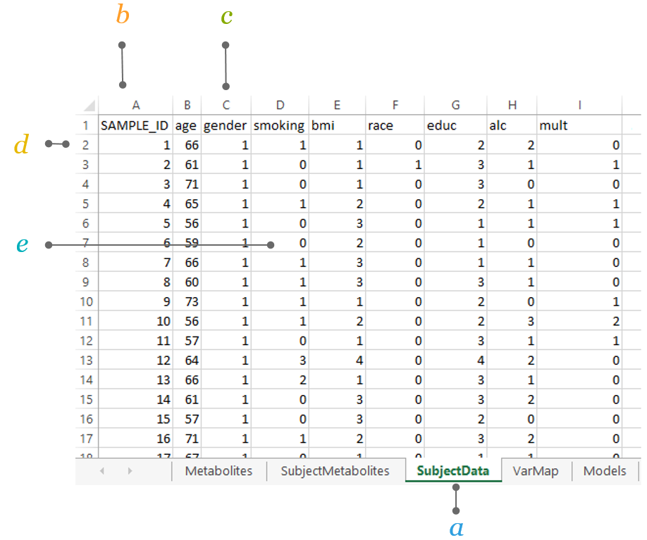</a>

### VarMap
The __*VarMap*__ sheet contains the coding scheme for the covariates in your analysis, and maps the cohort variable names to the COMETS internal variable names. For projects in COMETS, which represent multi-cohort efforts coordinated by a central PI, this scheme will be completed by the PI and sent to you as part of their example data input files. There is no need to modify. 
 Example: The cohort variable __bmi__ would be mapped to the COMETS internal variable __bmi_grp__ and must be coded as “0” for BMI<18.5, “1” for BMI 18.5 to <25, “2” for BMI 25 to <30, “3” for BMI 30.0+, and “4” for missing as defined in the column __VARDEFINITION__. 

**a. VarMap** sheet maps the cohort variable name and COMETS variable name. For example, subjects are identified in COMETS as id while the cohort uses sample_id. 
 
**b. VARREFERENCE**  refers to the COMETS variable name.
 
**c. VARDEFINITION** defines how the variables should be coded.
 
**d. COHORTVARIABLE** corresponds to the cohort variable name. 
 
**e. VARTYPE** corresponds to type of variable expected as continuous or categorical. 
 
**f. COHORTNOTES** gives additional info for some variables (e.g., __age__, __female__), missing values are not allowed. 

<a href="static/input_4varmapv2.PNG" target="_blank">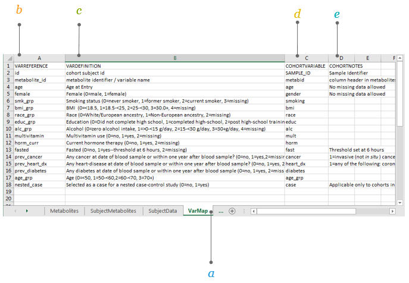</a>

### Models {#inputmodels}
This worksheet specifies the models to run. In this example, Model “2.1” is named “Gender stratified” and the analysis will be run with “age” as the exposure and “All metabolites” as the outcomes, while adjusting for smoking status (__smk_grp__), BMI (__bmi_grp__), race (__race_grp__), education (__educ_grp__), alcohol consumption (__alc_grp__), multivitamin use (__multivitamin__), hormonal status (__horm_curr__), and fasting status (__fasted__). This analysis will be stratified by gender using the internal COMETS variable __female__.

Specify the analytical models you wish to run.  

 
 **a. Models** sheet describes the models for analyses.
  
 **b. MODEL**  contains the model number and the model name. The results files will be named according to the chosen model name.
  
 **c. OUTCOMES** specifies which variable(s) will be the dependent variable(s).
  
 **d. EXPOSURE** specifies the independent variable of interest. The beta coefficient for this variable will be returned in the results. 
  
 **e. ADJUSTMENT** specifies the potential confounders to be included in the model (optional).
  
 **f. STRATIFICATION** for stratified analyses only. Results will be returned for all strata within this variable (optional).
   
 **g. WHERE** if the analysis is meant to be run on only a subset of the cohort, this column will contain the subset definition (e.g., “female==1” for an analysis stratified by hormone therapy use)(optional).
  
 
 

<a href="static/input_modelspecification.png">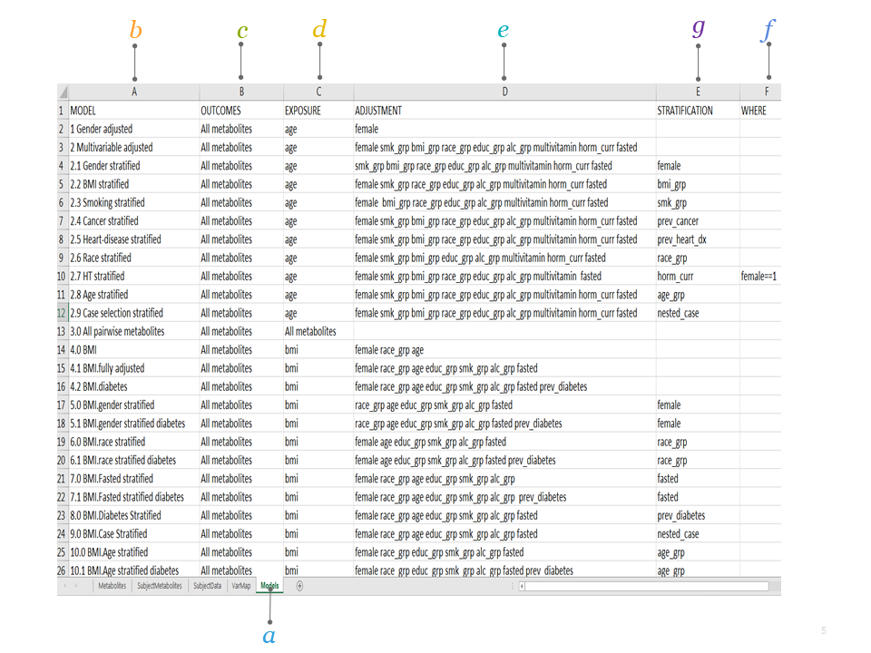</a>

## Step 2 Harmonization
The harmonization step will assess whether your cohort's metabolites are available in the master metabolites list, so that a universal ID (named __UID_01__) can be associated with your metabolites. The COMETS master metabolite list is maintained by IMS and can be sent in advance of the analyses to ensure availability of a universal ID for each of your metabolites. The universal ID ensures alignment of metabolites across the different cohorts to ensure identification for meta-analyses. Metabolite harmonization is made possible by maintaining an up-to-date master list of metabolites across platforms and cohorts to establish a universal metabolite ID. This activity is managed by the data harmonization work group and IMS. In order to maximize harmonization of metabolites, it is important to include as much information (i.e., metabolite meta-data) in the input file such as HMDB ID, KEGG ID, or other identifiers. For more details, see 

### Harmonization File
The names of metabolites input into the software are automatically harmonized to a common name. This important feature facilitates comparison of metabolites across different studies that use different platforms and/or naming conventions.

**a. metabid** corresponds to metabolite IDs as defined by each individual cohort. The metabolite IDs correspond to the column __metabid__ from the sheet __*Metabolites*__ of the input file.

**b. metabolite_names** corresponds to metabolite names as defined by each individual cohort. The metabolite names correspond to the column __metabolite_name__ from the sheet __*Metabolites*__ of the input file.

**c. Columns** (except A, B, and C) correspond to metabolite meta-information that was either already present in the input file or was matched from the internal COMETS database. We highly recommend to add at least one public database identifier (e.g., HMDB ID).

**d. Rows** correspond to metabolites, with each row containing all available meta-information for one metabolite.

<a href="static/output_harmonization.png">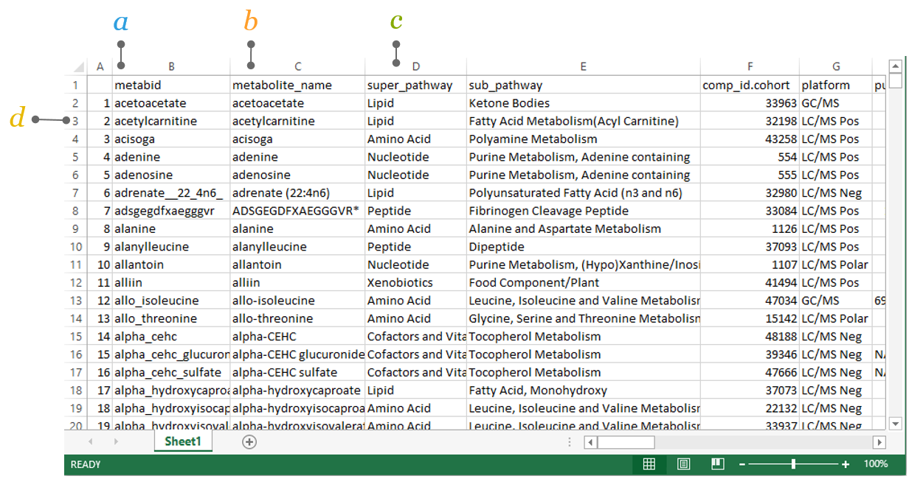</a>

## Step 3 Data and Model Integrity 
Data and integrity checks are run to ensure the appropriate data are presented for analyses. Please take note of the messages to correct your input file. In some cases, you will not be able to proceed to the analyses step. See Chapter \@ref(integrity) [Integrity Checks]

## Step 4 Run Models
There are two ways to run models: 1) interactive mode allows you to specify ad hoc models when exploring the data, and 2) batch mode models are prespecified through the model sheet in your input file which can be run one at a time or all models for running all models specified in the models sheet which uses a queueing system.

### Interactive Mode
   Allows you to run individual models to specify model parameters and receive instantaneous results by clicking on interactive model specification.
   
   
**a. Passed integrity check** after harmonization, if data upload was successful and the data passed COMETS integrity checks, you will get a confirmation message.
    
   **b. Specify interactive**  by clicking on *Interactive user input* under *Specify Method of Analyses*.
   
   

   
   
<a href="static/output_interactivemode_1.png">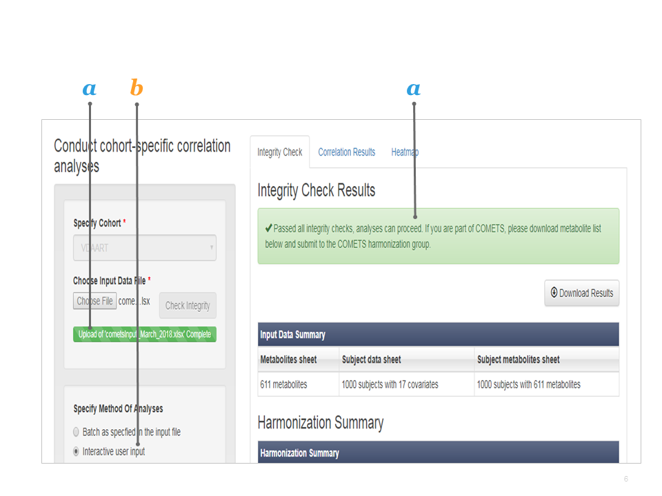</a>

#### Explore Your Interactive Mode Output
 Exploring your output. 
 

  **a. Correlation results ** if successful, click *Download Results*.
 
 **b. Specified model parameters **  as defined in the interactive mode.

 **c. Correlation coefficient: ** Spearman Rank correlation coefficient between the specified outcome and the exposure (adjusting for the __adjvars__, and by strata if applicable).
 
 **d. p-value** significance level for the correlation coefficient.
 
 **e. n** number of samples included in the specified model.
 
 **f. Tag** select metabolites for further analysis. This creates a subset of metabolites that can then be specified in the interactive output.
 
 

<a href="static/output_interactivemode_3.png">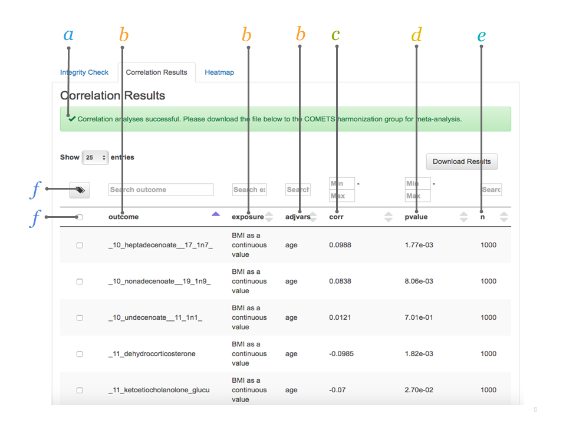</a>

**Explore further ** further results can be ordered according to name of outcome, exposure, or __adjvars__, or by correlation coefficient, p-value, or n. Alternatively, you can use the search boxes to search for specific metabolites or define thresholds. 

### Batch Mode

All Models is a special run of the prespecified models. In this mode, all models are run in a queue and you will get the results via email.

## Step 5 Correlation Analyses Output 
After running your correlation analyses by [Interactive mode] or [Batch mode], results are available under the correlation results and heatmap tabs. For other types of analyses, see [Manual]. Some of the interactive features of the results and heatmap are described below.

### Metabolite Tagging 
The metabolite tagging (*Tag* option) is a feature in the correlate and heatmap tabs to select and create a subset of metabolites for further analysis based on results for further investigation. Once tagged, the list of metabolites can be used in interactive mode to specify other analyses to conduct.

To select and create a subset of metabolites for further analysis based on the correlation results the tag function can be used.
Below an example with age (exposure) and metabolites (outcome) as run in the *Interactive user input Correlation Results* tab. 

**a. Set level of significance ** in this example the level of significance is defined as p<0.00001.
 
**b. Select significant metabolites**  by ticking the box all significant metabolites are selected.
 
**c. Tag metabolites ** by ticking the *Tag* box all selected metabolites are automatically marked.

<a href="static/output_heatmap3_1.PNG" target="_blank">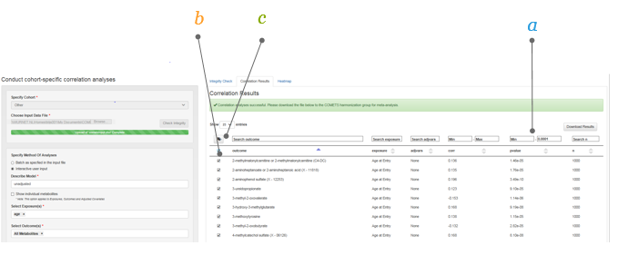</a>

### Create Subset of 'Tagged' Metabolites 

Once the *Tag* button is clicked a screen will appear 

**a. Name your Tag ** give the subset of metabolites a name (e.g., “age_related_metabolites”). 
 
**b. Create Tag ** click the button *Create Tag* to create the tag. 
 
**c. Tag is created ** a new box appears with an overview of your tagged metabolites. Close the newly created tag.

<a href="static/output_heatmap3_2.PNG" target="_blank">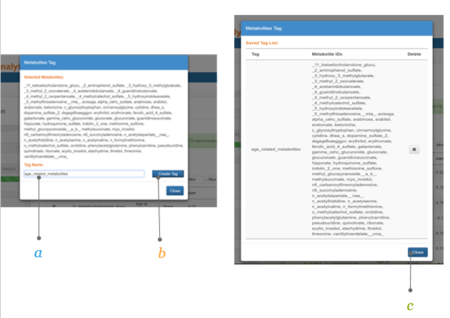</a>

### Create A Heatmap 

Go back to the *Interactive user input* and select your newly created subset, using the *Tag* function

**a. Select your exposure ** select the newly created "age_related_metabolites" tag. 
 
**b. Select your outcome**  select the newly created "age_related_metabolites" tag. 
 
**c. Run the model ** click the *Run* button.
 
**d. Heatmap** select the *Heatmap* tab to view the heatmap. 

<a href="static/output_heatmap3_3.PNG" target="_blank">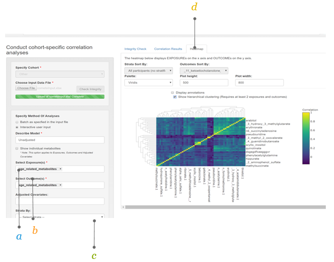</a>

### The Heatmap 

Exposures are specified on the x-axis and the outcomes on the y-axis. Different features are available in this interface.

**a. Sort by outcome ** the display of the heatmap can be sorted by outcome or exposure (in the *Outcomes Sort By* box). 

**b. Sort by strata**  when a stratified analysis is performed, the display of the heatmap can be sorted by the different strata (in the *Strata Sort By* box). 
 
**c. Choose your color ** in the *Palette* box different color schemes for the heatmap can be selected. 
 
**d. Adjust plot height and width** the *Plot height* and *Plot width* can be adjusted using their respective boxes. 

<a href="static/output_heatmap3_4.PNG" target="_blank">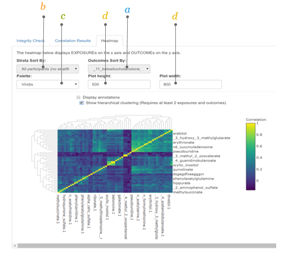</a>

### The Heatmap (2)

Additional features of the heatmap can be chosen.

**a. Additional toolbar ** when moving the mouse in the top right corner of the graph an extra toolbar will be visible which allows you to:

   Download plot as png
 
   Save and edit plot in cloud
 
   Zoom in and out
 
   Pan
 
   Autoscale
 
   Reset axes
 
   Use Plotly features (e.g., toggle spike lines, show closest data on hover, compare data on hover)  

<a href="static/output_heatmap3_5.PNG" target="_blank">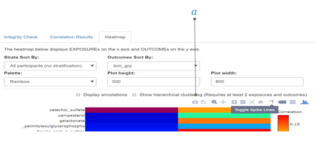</a>

### Annotations and Hierarchical Clustering

Annotations (display of the correlation coefficients in numbers) and hierarchical clustering (showing the metabolite clusters) can be superimposed on the heatmap.

**a. Annotations ** ticking this box will allow you to display the correlation coefficients in the plot. 
 
**b. Hierachical clustering ** ticking this box will allow you to display the metabolite clusters on the left side of the heatmap. 
 
**c. Choose your dimensions ** by clicking the *Plot height* and *Plot width* and entering values (e.g., 900 by 1100) the plot will show in the chosen dimensions. 

<a href="static/output_heatmap3_6.PNG" target="_blank">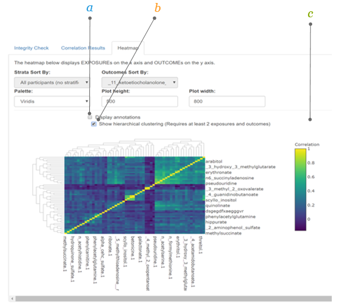</a>

For details on outputs from other models, see the output section of each method under Chapter \@ref(manual) [Manual]. 

## Step 6 Send for Meta-analyses 
After you receive email notification of a successful run of all models, please forward the email to comets.analytics@gmail.com. The results will be meta-analyzed centrally.
